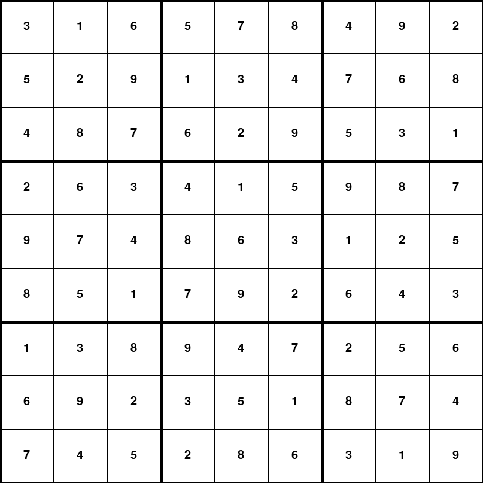
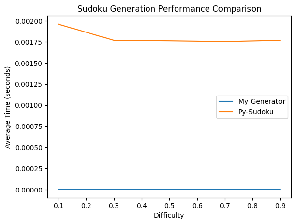
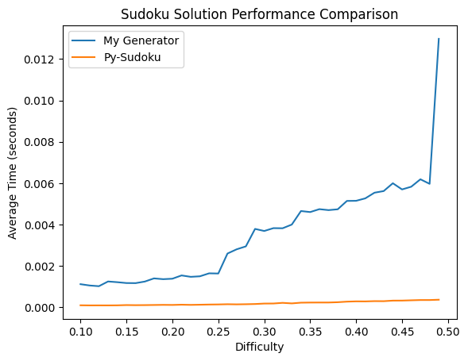
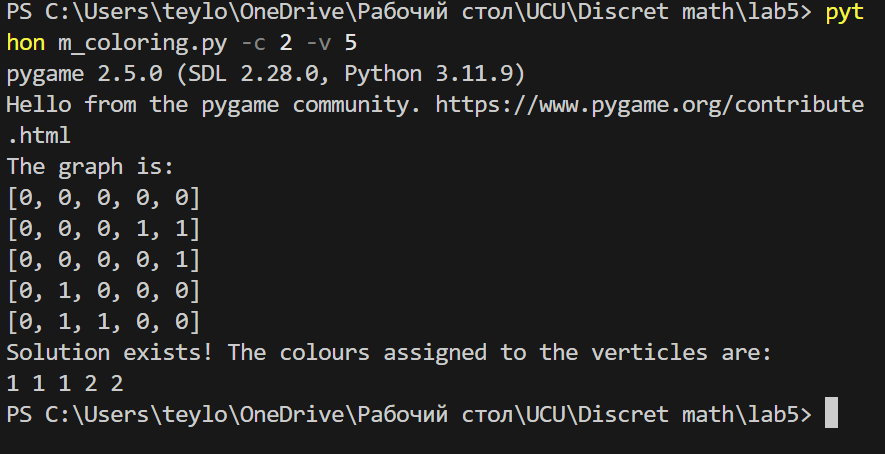
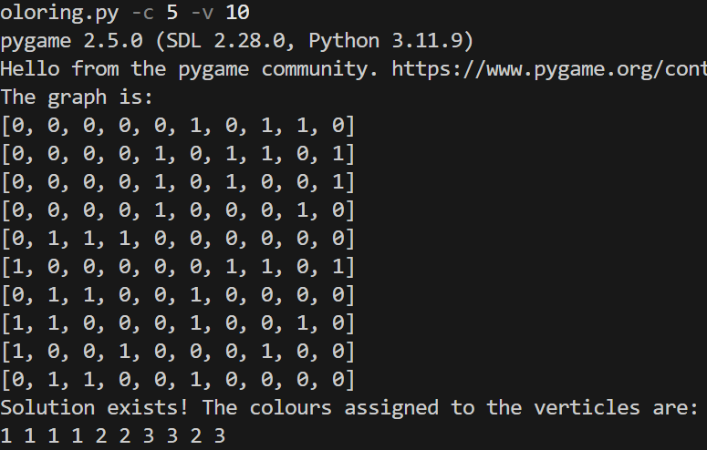
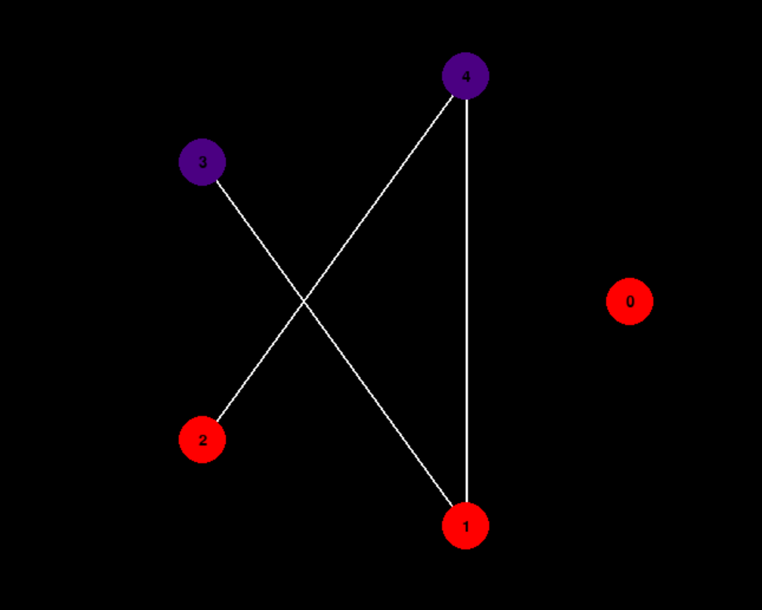
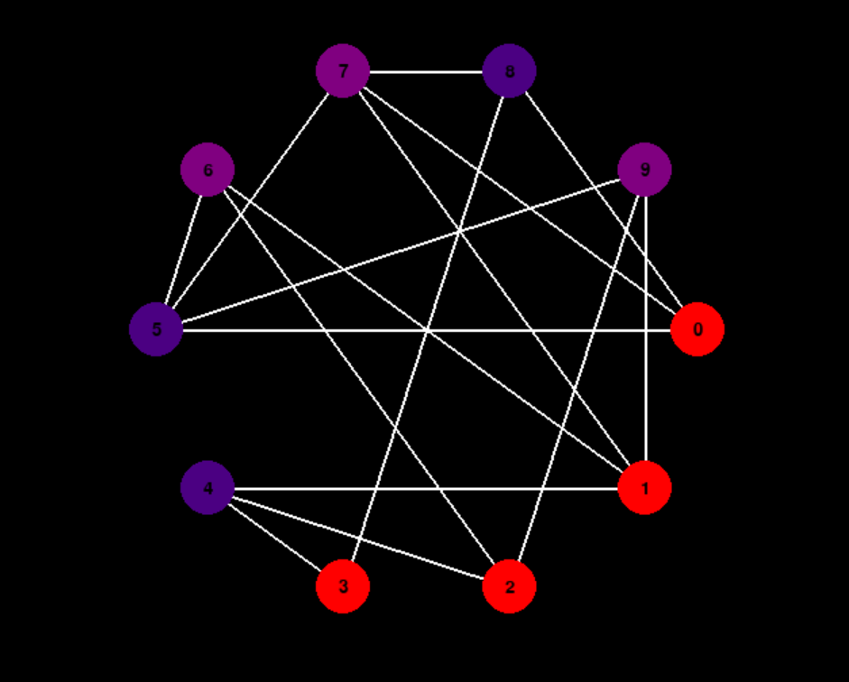

# Backtracking

Backtracking - це метод розв'язання задач, який використовується в програмуванні для пошуку рішень у просторі можливих варіантів. Він працює шляхом послідовного спробування різних варіантів рішення, відходячи назад при виявленні, що поточний шлях не веде до рішення. Це особливо корисно у задачах, де потрібно знайти всі можливі рішення або знайти рішення, які задовольняють певні критерії, наприклад, пошук шляхів у графі або генерація всіх перестановок або комбінацій.
Однак, backtracking може бути неефективним, оскільки він може вимагати великої кількості повторних розрахунків, особливо для великих просторів пошуку. Для покращення ефективності використовуються різні техніки, такі як обмеження пошуку, використання хеш-таблиц для збереження вже перевірених станів та застосування алгоритмів, які мінімізують кількість необхідних кроків.

## Судоку

Програма для вирішення Судоку використовує бібліотеку Pygame для візуалізації процесу вирішення. Код структуровано навколо класу Solver, який відповідає за логіку вирішення Судоку та візуалізацію процесу.

### Основні компоненти

•	Клас Sudoku відповідає за налаштування графічного інтерфейсу за допомогою бібліотеки Pygame. Під час ініціалізації, цей клас встановлює розміри екрану та сітки для гри, які пропорційно залежать від висоти екрану користувача. Це дозволяє гнучко адаптувати розміри графічного інтерфейсу до різних роздільних здатностей пристроїв. Такий підхід забезпечує зручне та ефективне відображення гри на екрані користувача.

•	Метод draw_grid у програмі для розв'язання Судоку відповідає за створення візуальної репрезентації сітки гри на екрані. Він малює лінії сітки, що допомагають користувачеві краще розуміти розташування клітинок та їхній внутрішній порядок.

•	Метод draw_numbers у програмі для розв'язання Судоку відображає числа, що представляють головоломку, на графічному інтерфейсі гри. Він використовує функціонал бібліотеки Pygame для рендерингу тексту та правильного відображення чисел у відповідних клітинках сітки.

•	Метод check_board перевіряє, чи можна помістити число в конкретну клітинку на сітці Судоку, дотримуючись правил Судоку. Також є метод check_start_board, який перевіряє початкову сітку на правильність входу. Перевіряється чи з цим числом в рядку, стовпці та під-сітці(розміри 3*3) всі числа, окрім 0, є унікальними і в діапазоні від 0 до 9 включно. 0 включається, бо він означає пустоту у цій реалізації.

•	Метод complete використовує backtracking для повного заповнення сітки гри. Він систематично перевіряє можливі варіанти розстановки чисел, застосовуючи принцип послідовної спроби та відхилення від невдалих шляхів. Цей процес триває до тих пір, поки не буде досягнуто повного розв'язання Судоку або не виявлено, що розв'язок неможливий. Таке комплексне вирішення дозволяє отримувати правильні результати, враховуючи всі правила гри.

•	Метод solve ініціює виконання алгоритму вирішення гри. Під час його роботи кожен крок процесу розв'язання відображається на екрані, надаючи користувачеві візуальне уявлення про те, як алгоритм працює. Після завершення процесу розв'язання, отриманий результат зберігається у вигляді зображення "sudoku_grid.png", що дозволяє зручно зберегти та поділитися кінцевим розв'язком.

### Вхідні дані

Програма приймає вхідний файл з розкладкою Судоку або генерує випадкову розкладку. Файл повинен містити 9 рядків, кожен з яких містить 9 цифр від 0 до 9, представляючи собою сітку Судоку.

### Виведення
Кінцевий результат вирішення Судоку зберігається як зображення "sudoku_grid.png" (після закриття вікна pygame). В процесі вирішення кожен крок відображається на екрані.

### Виконання
Програма може бути запущена з вхідним файлом або без нього, коли вона автоматично генерує випадкову розкладку Судоку за допомогою бібліотеки py-sudoku або власної імплементації. Використання аргументу –input_file дозволяє вказати файл з розкладкою Судоку, аргумент --choose_generation дозволяє обрати чи запустити власну імплементацію генерації сітки судоку чи з бібліотеки py-game, а --difficulty -- кількість незаповнених клітинок (складність).

Часова складність: O(9^(N^2)), оскільки для кожного невикористаного індексу є 9 можливих варіантів. Просторову складність можна оцінити як O(N^2), оскільки для зберігання масиву виводу потрібна матриця.

### Приклад візуалізації



### Порівняння з py-sudoku у генерації та вирішенні (без візуалізації)



## Лабіринт

**Розв'язування Лабіринту з Використанням Алгоритму Повернення Назад**

Ця програма на Python призначена для розв'язання лабіринтів за допомогою алгоритму повернення назад. Вона зчитує файл лабіринту, аналізує його структуру, знаходить шлях розв'язку та потім зберігає розв'язок у інший файл. Крім того, вона надає можливість візуалізації розв'язаного лабіринту.

### Як користуватися:

1. **Встановлення:**
   - Клонуйте або завантажте репозиторій із скриптом.
   - Переконайтеся, що на вашій системі встановлено Python 3.x.

2. **Запуск Скрипта:**
   - Відкрийте термінал чи командний рядок.
   - Перейдіть до каталогу із скриптом.
   - Запустіть скрипт, виконавши `python maze.py [source_file] [destination_file]`.
     - `[source_file]`: Шлях до файлу лабіринту.
     - `[destination_file]`: Шлях до файлу, куди буде збережено розв'язаний лабіринт.

3. **Додаткові Аргументи:**
   - `-v, --visualize`: Для візуалізації розв'язаного лабіринту. Додайте цей прапорець при запуску скрипта.

### Формат Файлу Лабіринту:

- Файл лабіринту повинен бути текстовим файлом, що містить структуру лабіринту.
- Перший рядок файлу має вказувати розмір лабіринту у форматі `РЯДКИ x СТОВПЦІ`.
- Наступні рядки мають представляти стіни у лабіринті у форматі `СТІНА рядок стовпець`, де `рядок` та `стовпець` - це координати стін.

### Приклад:

```
РЯДКИ 3 СТОВПЦІ 3
СТІНА 0 1
СТІНА 1 1
СТІНА 1 2
```

### Примітки:
- **Приклади лабіринтів:**
  - У текстових файлах у директорії labyrinth вже надано достатньо лабіринтів для тестування програми.
  - Також ми надали програму maze_gen.py, що дозволяє генерувати лабіринт. (Як її використовувати описано нижче) 

- **Залежності:**
  - Цей скрипт залежить від модулю `maze_visual` для візуалізації. Переконайтеся, що він знаходиться в тій самій директорії.

- **Поради щодо Використання:**
  - Переконайтеся, що файл лабіринту відповідає вказаному формату для точної обробки.
  - Для великих лабіринтів процес розв'язання може зайняти деякий час.


**Генерація Лабіринту**

Ця програма на Python призначена для генерації лабіринтів. Вона створює лабіринт, використовуючи алгоритм згортання, та зберігає його в файлі.

### Як користуватися:

  **Запуск Скрипта:**
   - Відкрийте термінал чи командний рядок.
   - Перейдіть до каталогу із скриптом.
   - Запустіть скрипт, виконавши `python maze_gen.py [рядки] [стовпці] [вихідний_файл]`.
     - `[рядки]`: Кількість рядків у лабіринті.
     - `[стовпці]`: Кількість стовпців у лабіринті.
     - `[вихідний_файл]`: Шлях до файлу, куди буде збережено лабіринт.

### Формат Файлу Лабіринту:

- Файл лабіринту буде створений у текстовому форматі.
- Перший рядок файлу буде містити розмір лабіринту у форматі `РЯДКИ x СТОВПЦІ`.
- Наступні рядки будуть представляти стіни у лабіринті у форматі `СТІНА рядок стовпець`, де `рядок` та `стовпець` - це координати стін.

### Приклад:

```
РЯДКИ 3 СТОВПЦІ 3
СТІНА 0 1
СТІНА 1 1
СТІНА 1 2
```

### Примітки:

- **Залежності:**
  - Додаткові бібліотеки не потрібні. Програма використовує стандартні бібліотеки Python.

- **Поради щодо Використання:**
  - Вказуйте кількість рядків і стовпців для створення лабіринту.
  - Переконайтеся, що вказаний вихідний файл має розширення `.txt`.

## Приклад візуалізації лабіринту


## Кросворд

## M-coloring

M-coloring problem є класичною задачею в теорії графів. Задача полягає в розфарбуванні невпорядкованого графа з використанням не більше, ніж 𝑚 кольорів так, щоб жодні два суміжні вершини графу не були розфарбовані одним кольором. Ця проблема має застосування в різних галузях, таких як планування, розподіл реєстру в компіляторах та призначення частот у телекомунікаціях.

### Реалізація

### 1. class Graph():

- **\_\_init\_\_**: Ініціалізує граф, приймаючи опційно параметр `verticles` (кількістб вершин графа). Якщо `verticles` не наданий, використовується функція `generate_adjacency_matrix` для створення абсолюьно випадкового графа. Якщо к-ть вершин вказана, то вона враховується при генерування графа. Ребра генеруються випадковим чином.

- **is_safe**: Перевіряє, чи можна призначити кольору `c` вершині `v`, перевіряючи всі суміжні вершини. Повертає `True`, якщо призначення безпечне, тобто кольор `c` ще не використовувався для суміжних вершин, і `False` в іншому випадку.

- **graph_colouring_util**: Використовує алгоритм backtracking для розв'язання проблеми розфарбування графа з не більш ніж `m` кольорами. Рекурсивно намагається призначити кольори кожній вершині так, щоб вони не були однаковими для суміжних.

- **graph_colouring**: Викликає `graph_colouring_util` для знаходження розв'язку проблеми розфарбування графа. Повертає список кольорів, призначених вершинам, або повідомлення про те, що розв'язків не існує.

- **visualize_graph**: Візуалізує граф з призначеними кольорами за допомогою бібліотеки `pygame`. Кожна вершина представлена розфарбованf відповідним кольором.

### 2. Функція `generate_adjacency_matrix`

- **generate_adjacency_matrix**: Генерує випадкову матрицю суміжності, що представляє граф. Вона визначає випадкову кількість вершин (якщо їх кількість не була надана) і підраховує максимальну кількість ребер, а потім випадковим чином встановлює з'єднання між вершинами, формуючи неорієнтований граф.

### 3. Головна функція `main`

- **main**: Створюється екземпляр класу Graph. Виводиться матриця суміжності графу. Перевіряється наявність аргумента -v або --vertices за допомогою argparse. Якщо аргумент заданий, граф створюється з вказаною кількістю вершин. В іншому випадку, граф створюється зі стандартною кількістю вершин. Отримується кількість кольорів для розфарбовування графу за допомогою argparse. Виконується алгоритм розфарбовування графу з використанням заданої кількості кольорів. Результат розфарбовування графу виводиться у консоль. Якщо розфарбовування графу було успішним, виконується візуалізація графу із призначеними кольорами за допомогою Pygame.

## Вхідні дані (зі сторони користувача)
- Кількість кольорів для розфарбування графа
- Кількість вершин графа (опційно)

## Виконання та складність
- Програма генерує випадковий граф та вирішує проблему розфарбування графа з заданою кількістю кольорів.
- Вирішення проблеми виконується за допомогою алгоритму backtracking.
- У найгіршому випадку, коли алгоритм повинен розглянути всі можливі комбінації кольорів для кожної вершини, складність становить 𝑂(𝑚^𝑁), де N - кількість вершин у графі, а m - кількість кольорів. Алгоритм потребує O(V) простору.
- Для візуалізації графа використовується бібліотека pygame.

## Виведення
- Програма виводить список кольорів, призначених кожній вершині, або повідомлення про те, що розв'язок не існує.
- Якщо розв'язок існує, вона також візуалізує граф з призначеними кольорами.

## Приклад реалізації

```
python m_coloring_problem.py -c 2 -v 5
```

 

## Приклад візуалізації:

 
